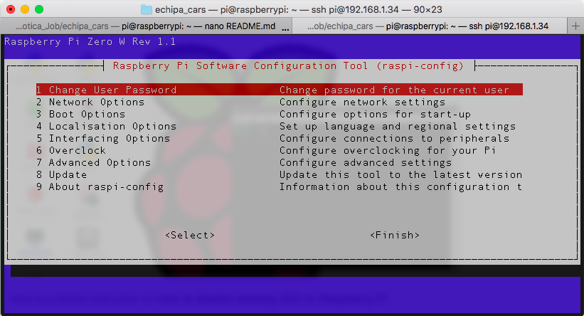
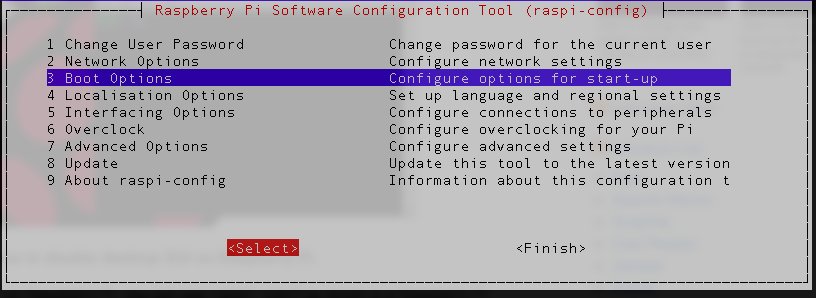
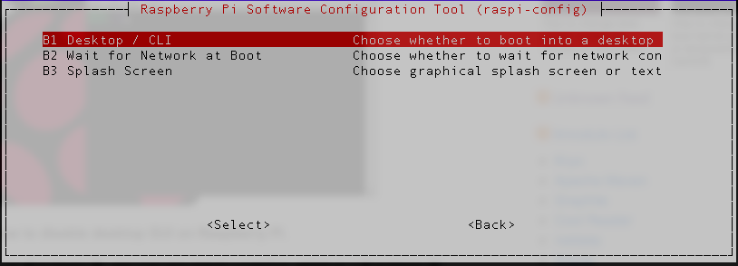
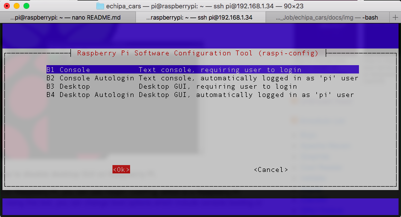

# Configurare Raspberry Pi Zero

Primii pasi de configurare pot fi folositi din [documentatia lor](https://projects.raspberrypi.org/en/projects/raspberry-pi-setting-up).

Aceasta ar trebui sa asigure un sistem bootabil pe Raspberry. In continuare, trebuie sa asiguram posibilitatea unei configurari ssh, si sa dezactivam interfata grafica.

Pentru SSH, am folosit informatii de [aici](https://www.raspberrypi.org/documentation/remote-access/ssh/), iar pentru a dezactiva interfata grafica, dupa cum urmeaza:

Fie direct de pe raspberry pi, fie printr-o conexiune SSH, scrieti in linia de comanda urmatoarele:

`sudo raspi-config`

Aceasta va va aduce intr-un meniu cum urmeaza: 

Din acest meniu, selectam optiunea `Boot Options`, apoi `Desktop / CLI`:

De aici selectam prima optiune, mai exact `Console`, apasam `TAB` pentru a putea selecta `OK`, apoi apasam `ENTER`.

In acest moment am dezactivat bootarea cu interfata grafica, si avem SSH functional.
